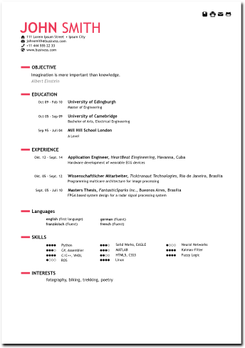

# Resume

Since I was bored of my old resume I designed a new one. One version I designed in HTML5 and CSS3. To make it as stable as possible I do not use any scripts. A further version I designed in SVG (using inkscape). This one has been converted to pdf.

## Colors

At the moment the red version is available only. However, different colors will be coming soon.

## Typography 

I am not an expert in these things, so I used Trebuchet MS font. It is popular and whitespread. Besides it is a good sans serif alternative to Arial.

## Pictograms

Thanks and all credits to Daniel Bruce for the beautiful pictograms. All of them (except countX.svg) have been taken from Daniels website — www.entypo.com.

## License

The work is licensed under Creative Commons. You are free to use the templates, also for commersial use. A mention like “Resume Template by Andreas Gschossmann — https://github.com/nerdOmat/resume ” is considered acceptable attribution. You can place this in the footer of your website, on an about page or in the code if you don’t wanna give it to much attention.

## TODO

 - [ ] add colors (blue.css, red.css, orange.css, green.css)
 - [ ] automize content management (change both, html5 and svg and put content into one xml-file)
 - [ ] make two versions (with and without image)
 - [ ] add XING and LinkedIn to cv.svg
 - [ ] add print.css
 - [ ] embed Trebuchet MS online

